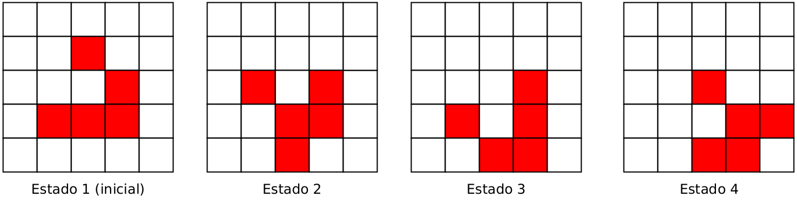
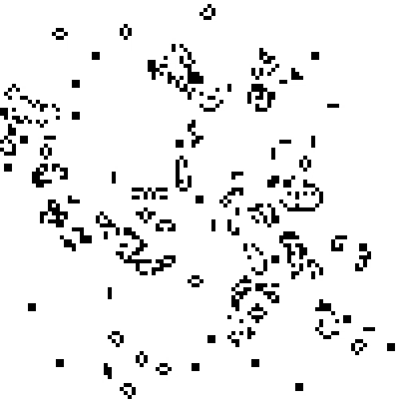
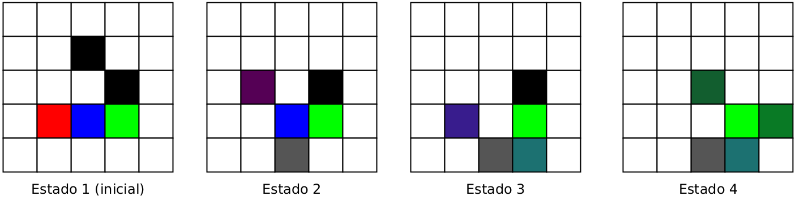
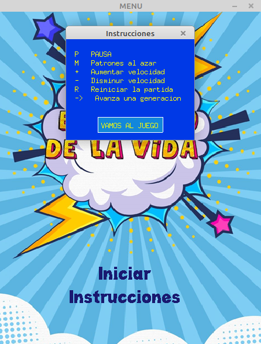
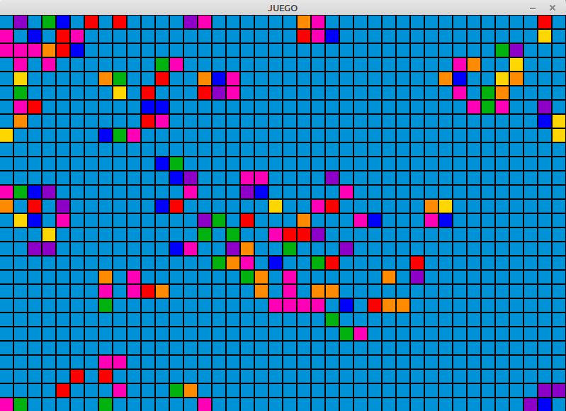

# El juego de la vida

El juego de la vida es quizás uno de los ejemplos mejor conocidos de autómatas celulares. Propuesto por el matemático John Conway, el juego de la vida ha sido objeto de numerosos estudios y existen múltiples versiones de él. En este proyecto, nos enfocaremos en una de esas versiones.

El juego no tiene jugadores. En su lugar, depende de una configuración inicial la cual va evolucionando a medida que pasa el tiempo. El escenario es el siguiente: Tenemos una grilla o matriz de celdas, la cual puede ser de cualquier tamaño (incluso de tamaño infinito). Cada celda representa uno de dos estados: activa o inactiva. De esa manera, una configuración o estado inicial del juego consiste de una matriz de n filas y m columnas, donde todas las celdas están en uno de los dos estados válidos. A partir del estado inicial, se aplican las siguientes reglas: 


1. Para que una celda siga activa, tiene que tener 2 o 3 celdas vecinas que también estén activas. Si se tienen más celdas vecinas activas, entonces la celda se desactiva. De manera similar, si se tienen menos de 2 celdas vecinas activas, la celda también se desactiva.
2. Si una celda inactiva tiene exactamente 3 celdas vecinas activas, entonces esta celda vuelve a activarse.

La siguiente figura muestra un ejemplo de la aplicación de las reglas, donde las celdas activas se muestran en rojos y las inactivas en blanco.

  

Es importante notar que las reglas se aplican a todas las celdas a la vez. A modo de analogía, el juego tiene un reloj interno (como el de los computadores), donde en cada nuevo 'tic' se aplican las 2 reglas a todas las celdas.

Según la configuración inicial, se pueden obtener estados estáticos (que no cambian con el paso del tiempo), cíclicos (una serie de patrones que se repiten) o no cíclicos. Las siguientes imágenes muestran ejemplos interesantes de patrones:

  
  

Adicionalmente, el [siguiente video](https://www.youtube.com/watch?v=OWXD_wJxCKQ) explica las reglas.

Para este proyecto se pide implementar el juego de la vida usando todo lo que han aprendido en el curso. A continuación se describe el detalle de lo solicitado:

- **Implementación base**: Se pide implementar una versión base, la cual implementa las reglas básicas del juego y genera la configuración inicial de manera aleatoria. En esta implementación base se pide una interfaz de visualización sencilla, utilizando impresiones por pantalla para mostrar la evolución del juego y la cantidad de pasos (o 'tic's) que se han ejecutado.
- **Extensión 1**: La implementación base se puede extender con al menos 4 las siguientes funcionalidades:
  * Cargar la configuración o estado inicial a partir desde un archivo
  * Guardar la configuración o estado actual a un archivo
  * Pausar el juego luego de presionar la tecla 'P'
  * Insertar nuevos patrones al azar durante la ejecución al presionar la tecla 'M'. Para esta funcionalidad se puede tener predefinidos algunos patrones de antemano (por ejemplo, patrones en L, patrones en T, etc).
  * Visualización de estadísticas, como porcentaje de casillas activas vs inactivas, cantidad de celdas que han cambiado su estado respecto a la configuración anterior, etc.
  * Detener la ejecución cuando ya no hay cambio entre configuraciones o estados consecutivos (se alcanzó un estado estático)
  * Alguna otra funcionalidad que puedan proponer los alumnos. Se evaluará la complejidad de la funcionalidad propuesta. En caso de ser muy simple, podría no ser considerada.
- **Extensión 2**: Mejorar la interfaz de visualización por medio del uso de la biblioteca SDL.
- **Extensión 3**: Implementar una variante *El juego de la vida, versión arcoiris*. Esta variante suma a las 2 reglas básicas el uso de colores. Inicialmente, las casillas activas pueden tener colores al azar. Luego, si una casilla inactiva es activada por medio de las reglas básicas, el color de esa casilla será el color promedio de sus 3 vecinos activos. Para calcular el color promedio use colores en RGB. De esa manera, basta con calcular el promedio en la banda de los rojos, el promedio de la banda de los verdes y la banda de los azules. Las siguientes figuras muestran un ejemplo de la nueva variante. 

  

## Solución propuesta
- Autor   : Pablo López (pablopez2019@udec.cl), Vicente Ríos (vrios2020@udec.cl) y Yulissa Sanhueza (ysanhueza2019@udec.cl)          
- Archivos : main.c, funciones.h y variables.h
- Compilación: 
 ```
make
 ```
- Ejemplo ejecución  : 
 ```
./juego_vida
 ```

|  |
|:--:|
| **Imagen de inicio**|
|  |
| **Menú**|
|:--:|
|  |
| **Screenshot de ejecución**|
