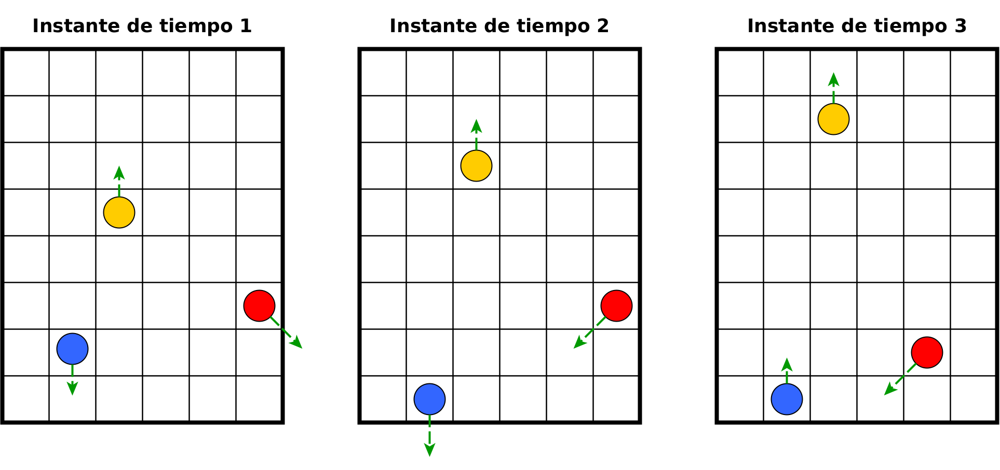

# Colisión de objetos

En este proyecto semestral implementaremos un sistema (simple) de colisiones de
objetos. Entenderemos como un sistema de colisiones a una grilla finita cuyos
índices de filas y columnas servirán coordenadas de objetos en movimiento. Los
objetos posicionados en la grilla tendrán una velocidad y una dirección, lo que
les permite desplazarse a medida que pasa el tiempo. La siguiente figura muestra
un sistema de colisiones en 3 instantes de tiempo, donde la flecha muestra la
dirección de desplazamiento de los objetos.

  

## Manejo de colisiones
Ya que trabajaremos con objetos en movimiento, las colisiones entre objetos, y
entre objetos y los límites de la grilla son inevitables. Para este proyecto
usaremos la siguiente simplificación, con el objetivo de resolver las
colisiones:

1. Todo objeto tendrá un peso asociado
2. Cuando dos objetos colisionan, el objeto de mayor peso no cambia su trayectoria, mientras que el objeto de menor peso tendrá una nueva trayectoria seleccionada al azar. En el caso de objetos con igual peso (empate), ambos tendrán que seleccionar una nueva trayectoria al azar.
3. Cuando un objeto choca contra uno de los límites de la grilla, su seleccionará una nueva trayectoria válida al azar.

A modo de ejemplo, observe las siguientes figuras, las cuales muestran tres
ejemplos de colisiones, donde el número que acompaña a los objetos representa su
peso. 

  

## Organización del proyecto
El proyecto constará de tres fases:

1. **Fase 1 - trabajo individual**: Esta primera fase constará de tres tareas (ver el detalle más adelante), donde cada estudiante será asignado/a para realizar una de las tareas. 
2. **Fase 2 - trabajo grupal**: Una vez finalizado el trabajo individual, se conformarán de manera aleatoria grupos de 3 estudiantes. La formación de grupos asegurará que cada grupo esté conformado por estudiantes que han desarrollado las tres tareas del proyecto. El trabajo grupal consistirá en combinar lo desarrollado de manera individual para tener el primer prototipo del sistema de colisiones.
3. **Fase 3 - mejora de la fase 2**: En esta última fase los integrantes de los grupos conformados en la fase 2 deberán implementar mejores a lo realizado en dicha fase (ver más adelante las mejoras solicitadas)


Las tres tareas de la primera fase serán las siguientes:

1. **Tarea 1: Lectura de coordenadas**. En esta primera tarea, se deberán leer las
coordenadas y direcciones iniciales de los objetos. Estas coordenadas podrán
venir almacenadas en distintos tipos de archivos, por ejemplo CSV, binario o
texto.
2. **Tarea 2: Desplazamiento y manejo de colisiones**. En esta tarea se debe implementar toda la lógica del manejo de colisiones, descrita previamente. Se pueden añadir nuevas lógicas, siempre y cuando pueda ser justificado. En esta tarea se debe manejar una cantidad arbitraria de puntos.
3. **Tarea 3: Visualización de objetos en movimiento**. En esta tarea deberán implementar una interfaz gráfica para visualizar los objetos en la grilla. Para realizarlo podrán utilizar ASCII art, el cual, mezclado con el uso de colores, puede proveer una buena alternativa para visualizar los objetos (ver en la sección de mejoras para más alternativas). Para esta tarea se constará son lo siguiente:


## Mejoras a la implementación base
Por sobre la implementación base mostrada en el diagrama anterior, se pueden
implementar los siguientes paquetes de mejora

1. **Paquete 1: Almacenamiento y cambio de estados**. En este paquete de mejoras
se incluyen todas aquellas mejoras que permitan el almacenamiento del estado
actual de la grilla, así como cambios en su estado. Algunos ejemplos de nuevas
funcionalidades son: guardar el estado actual de las colisiones o cargar un
estado desde archivo
2. **Paquete 2: Mejora en la usabilidad/jugabilidad**. Este paquete de mejoras
busca hacer más interactivo el sistema de colisiones. Ejemplo de nuevas
funcionalidades son: añadir nuevos elementos a la grilla, reducir el peso de los
objetos que colisionan, contador de colisiones, etc.
3. **Paquete 3: Mejoras en la visualización**. Este paquete de mejoras busca hacer
más atractiva la interfaz desarrollada. Alguna posibles mejoras son: uso de
SDL2, usar colores en los objetos, añadir efectos de sonido, etc
4. **Paquete 4: Mejoras personalizadas**. Este paquete incluye cualquier mejora propuesta por el equipo de trabajo que no haya sido considerada en los paquetes de mejora previos


## Solución propuesta
- Autor   : Chloe Yañez (chyanez2023@udec.cl), Braian Urra (burra2022@udec.cl) y Cristóbal González (cristobagonzalez2023@udec.cl)          
- Compilación: 
 ```
make
 ```
- Ejemplo ejecución  : 
 ```
./try.out
 ```
- Controles  : 
 ```
W: incrementar tamaño de la particula
S: Disminuir tamaño de la particula
N: Nueva Particula
P: Pausar
G: Guardar en binario datos de particulas
Q: Salir
Click Izquierdo en pantalla: generar obstáculo segun la posición del mouse (modo creativo)
 ```

|  |
|:--:|
| **Pantalla de inicio**|
|  |
| **Modo clásico**|
|  |
| **Modo creativo**|
|  |
| **Pantalla de créditos**|
